# Fairfield Inn Gainesville (383) — Live Payroll Schema ERD

Generated from `information_schema` against `integration_dev` on 2026-08-14. This reflects
the **actual `383_*` tables as loaded in the database** (hand-built landing with richer
detail than a plain ETL run — see [[fairfield-383-payroll-status]]). It differs from the
generic template in `payroll_schema_erd.md`: real FKs exist between the employee-detail
child tables, and `payroll_summary`/`payroll_summary_by_dept`/`stats_summary` have
property-specific columns (e.g. `net_cash`, `hours_analysis`, `cafeteria_125_detail`)
instead of the generic curated schema.

```mermaid
erDiagram
    "383_PAYROLL_RAW_LANDING" {
        bigint id PK
        int property_id
        text company_code
        text batch_number
        date pay_date
        text source_type
        text source_file
        int row_seq
        jsonb payload
        timestamptz ingested_at
    }

    "383_EMP_PAYROLL_DETAILS" {
        bigint id PK
        int property_id
        text company_code
        text batch_number
        date pay_date
        date report_period_start_date
        date report_period_end_date
        date check_date
        text file_number
        text employee_name
        text department_code
        text voucher_number
        numeric hol_hours
        numeric hol_amount
        numeric total_work_hrs
        numeric gross_amount
        numeric net_pay_amount
        numeric fit_amount
        numeric ss_ee_amount
        numeric medicare_ee_amount
        numeric state_amount
        jsonb memo_detail
        char currency
        smallint month
        smallint year
        boolean isactive
        text source_file
        timestamptz created_at
        timestamptz updated_at
    }

    "383_EMP_DEDUCTION_DETAILS" {
        bigint id PK
        int property_id
        text company_code
        text batch_number
        date pay_date
        bigint emp_payroll_detail_id FK
        text file_number
        text employee_name
        text deduction_type
        text deduction_code
        numeric deduction_amount
        boolean is_cafeteria_125
        boolean isactive
        text source_file
        timestamptz created_at
    }

    "383_EMP_PAY_RATE_DETAILS" {
        bigint id PK
        int property_id
        text company_code
        text batch_number
        date pay_date
        bigint emp_payroll_detail_id FK
        text file_number
        text employee_name
        text department_code
        smallint rate_seq
        numeric rate
        numeric reg_hours
        numeric reg_earn
        text ot_code
        numeric ot_hours
        numeric ot_earn
        boolean isactive
        text source_file
        timestamptz created_at
    }

    "383_PAYROLL_SUMMARY" {
        bigint id PK
        int property_id
        text company_code
        text batch_number
        date pay_date
        date period_ending_date
        smallint week_number
        text service_center
        numeric reg_hours
        numeric ot_hours
        numeric reg_earn
        numeric ot_earn
        numeric gross_amount
        numeric fit_amount
        numeric ss_amount
        numeric medicare_amount
        numeric state_amount
        numeric total_voluntary_deductions
        numeric net_payroll_checks_amount
        numeric total_deposits
        numeric net_cash
        int checks_count
        int vouchers_count
        int pays_count
        text starting_check_number
        text ending_check_number
        jsonb hours_analysis
        jsonb earnings_analysis
        jsonb memo_analysis
        jsonb statutory_ded_analysis
        jsonb voluntary_ded_analysis
        jsonb adp_check_numbers
        char currency
        smallint month
        smallint year
        boolean isactive
        text source_file
    }

    "383_PAYROLL_SUMMARY_BY_DEPT" {
        bigint id PK
        int property_id
        text company_code
        text batch_number
        date pay_date
        date report_period_start_date
        date report_period_end_date
        date check_date
        text department_code
        text department_title
        numeric pct_of_company
        numeric reg_hours
        numeric reg_earn
        numeric ot_hours
        numeric ot_earn
        numeric gross_amount
        numeric net_cash
        numeric fit_amount
        numeric ss_amount
        numeric medicare_amount
        numeric state_amount
        numeric total_deductions
        jsonb taxable_analysis
        jsonb memo_detail
        jsonb deduction_detail
        jsonb cafeteria_125_detail
        char currency
        smallint month
        smallint year
        boolean isactive
        text source_file
    }

    "383_STATS_SUMMARY" {
        bigint id PK
        int property_id
        text company_code
        text batch_number
        date report_period_end_date
        date pay_date
        smallint quarter_number
        numeric net_pay_checks
        numeric net_pay_direct_deposit
        numeric net_cash
        numeric fed_income_tax
        numeric ss_ee_amount
        numeric ss_er_amount
        numeric medicare_ee_amount
        numeric medicare_er_amount
        numeric futa_amount
        numeric state_income_tax
        numeric sui_er_amount
        numeric total_taxes_debited
        numeric retirement_401k
        numeric wage_garnishments
        numeric total_amount_debited
        jsonb detail
        char currency
        smallint month
        smallint year
        boolean isactive
        text source_file
    }

    "383_PAYROLL_JOURNAL" {
        bigint id PK
        int property_id
        text company_code
        text batch_number
        text external_id
        date transaction_date
        text posting_period
        text memo
        text subsidiary
        text gl_account_number
        text gl_account_name
        numeric debit
        numeric credit
        text memo_line
        text outlet
        char currency
        smallint month
        smallint year
        boolean isactive
        text source_file
    }

    "383_V_PAYROLL_RECONCILIATION" {
        int property_id
        text batch_number
        date pay_date
        numeric reg_gross
        numeric sum_gross
        numeric je_wages
        numeric sum_net_cash
        numeric stats_net_cash
        numeric je_debit
        numeric je_credit
        numeric total_amount_debited
        boolean gross_ties
        boolean net_ties
        boolean je_balances
    }

    "383_EMP_PAYROLL_DETAILS" ||--o{ "383_EMP_DEDUCTION_DETAILS" : "emp_payroll_detail_id (FK)"
    "383_EMP_PAYROLL_DETAILS" ||--o{ "383_EMP_PAY_RATE_DETAILS" : "emp_payroll_detail_id (FK)"
    "383_EMP_PAYROLL_DETAILS" }o--|| "383_V_PAYROLL_RECONCILIATION" : "property_id + batch_number + pay_date"
    "383_PAYROLL_SUMMARY"     }o--|| "383_V_PAYROLL_RECONCILIATION" : "property_id + batch_number + pay_date"
    "383_STATS_SUMMARY"       }o--|| "383_V_PAYROLL_RECONCILIATION" : "property_id + batch_number + pay_date"
    "383_PAYROLL_JOURNAL"     }o--|| "383_V_PAYROLL_RECONCILIATION" : "property_id + batch_number"
    "383_PAYROLL_RAW_LANDING" }o..|| "383_EMP_PAYROLL_DETAILS" : "property_id + batch_number + pay_date (no FK)"
    "383_PAYROLL_SUMMARY_BY_DEPT" }o..|| "383_PAYROLL_SUMMARY" : "property_id + batch_number + pay_date (no FK)"
```

## Notes
- **Real foreign keys** (only two exist in this schema): `383_emp_deduction_details.emp_payroll_detail_id`
  and `383_emp_pay_rate_details.emp_payroll_detail_id` both reference `383_emp_payroll_details.id`.
  Everything else is linked logically by the shared business key `(property_id, batch_number, pay_date)`,
  same convention as the generic template.
- **Unique constraints actually enforced in the DB**:
  - `383_payroll_raw_landing`: `uq_383_landing (source_file, source_type, row_seq)`
  - `383_emp_payroll_details`: `uq_383_empdet (property_id, batch_number, pay_date, file_number)`
  - `383_emp_deduction_details`: `uq_383_empded (property_id, batch_number, pay_date, file_number, deduction_code)`
  - `383_emp_pay_rate_details`: `uq_383_ratedet (property_id, batch_number, pay_date, file_number, rate_seq)`
  - `383_payroll_summary`: `uq_383_summ (property_id, batch_number, pay_date)`
  - `383_payroll_summary_by_dept`: `uq_383_summdept (property_id, batch_number, pay_date, department_code)`
  - `383_stats_summary`: `uq_383_stats (property_id, batch_number, pay_date)`
  - `383_payroll_journal`: `uq_383_je (property_id, batch_number, gl_account_number, memo_line)`
- **`383_v_payroll_reconciliation`** (view) joins `383_emp_payroll_details` (aggregated to batch level as `emp`),
  `383_payroll_summary`, `383_stats_summary` (LEFT JOIN), and `383_payroll_journal` (aggregated as `je`) to check
  `gross_ties`, `net_ties`, and `je_balances`.
- **Naming differs from the generic ETL template** (`payroll_schema_erd.md`): this property's data was hand-loaded
  with richer detail, so `payroll_register_line` became `383_emp_payroll_details` split out into two child tables
  (`383_emp_deduction_details`, `383_emp_pay_rate_details`), and `383_payroll_summary` gained a sibling
  `383_payroll_summary_by_dept` for department-level rollups. See [[fairfield-383-payroll-status]] and
  [[payroll-etl-pipeline]].
- **Excluded as out-of-domain**: `383_gl`, `383_gl_old_Jan_2026`, `383_inv`, `383_is_statement`, `383_is_summary`
  also exist under the `383_*` prefix but are GL/invoice/income-statement tables unrelated to payroll — not
  part of this ERD. There is also an unrelated top-level `journal_entries` table (RPA job tracking, not
  property-scoped).
- Source: live schema query against `integration_dev` via `information_schema.columns` /
  `table_constraints` / `pg_get_viewdef`, per [[payroll-db-config]].
