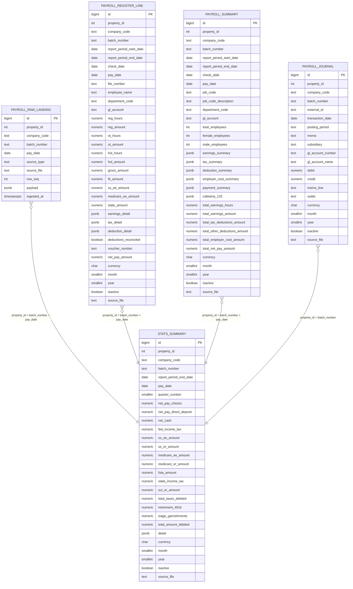

# Payroll ETL — Entity Relationship Diagram

Tables are parameterised by property id (`{p}`, e.g. `383`). There are no enforced
foreign keys between them — they are logically linked by the shared business key
`(property_id, batch_number, pay_date)`, as used in the `v_payroll_reconciliation` view.

## Notes
- **Unique keys per table** (enforce one row per logical grain):
  - `payroll_raw_landing`: (source_file, source_type, row_seq)
  - `payroll_register_line`: (property_id, batch_number, pay_date, file_number, department_code)
  - `payroll_summary`: (property_id, batch_number, pay_date, job_code, gl_account)
  - `stats_summary`: (property_id, batch_number, pay_date) — one row per batch
  - `payroll_journal`: (property_id, batch_number, gl_account_number, memo_line)
- **Reconciliation view** `{p}_v_payroll_reconciliation` joins `register_line`, `summary`, `stats_summary`, and `journal` on `(property_id, batch_number, pay_date)` to verify gross pay, net cash, and JE balance all tie out.
- Source: `D:\payrol_register\payroll_etl.py` lines 427–529.
